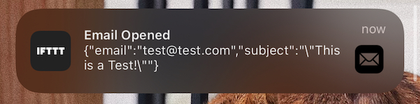

# 📟 Email Tracking Pixel

Who needs a fancy $30/month email app for seeing when someone opened your email when you can just do it yourself?

Simply paste a link in any of your emails, and you'll get notified by push notification when someone opens it.

## Setup

I'm using an IFTTT endpoint for push notifications, but this works with any webhook endpoint. If you choose to deploy with IFTTT, create a new "applet" with the mobile app so that you can allow push notifications. The trigger should be a "Webhook", and the service should be "Notifications".

You'll then need a personalized webhook from the IFTTT app. When you visit the Webhook Integration page, click "Documentation", and it'll generate you're webhook. It should look something like:

```
https://maker.ifttt.com/trigger/YOUR_SERVICE_NAME/json/with/key/YOUR_KEY
```

## Deploy

I'm deploying to a simple [Fly.io](https://fly.io) host, using the `fly.toml` file that's in the repo.

Set the environment variable for `WEBHOOK` when you're ready.

Then create a new Fly.io application with:

```bash
flyctl launch
flyctl secrets set WEBHOOK=https://maker.ifttt.com/trigger/YOUR_SERVICE_NAME/json/with/key/YOUR_KEY
```

## Usage

Once you have this deployed behind a public address, simply use the `/p` path and a few params. For example, you could do this:

```
https://some-dns.com/p?email=yourFriend@gmail.com&subject=LastEmail
```

I'm requiring both `email` and `subject` to avoid bot scraping spam but feel free to change it around.


